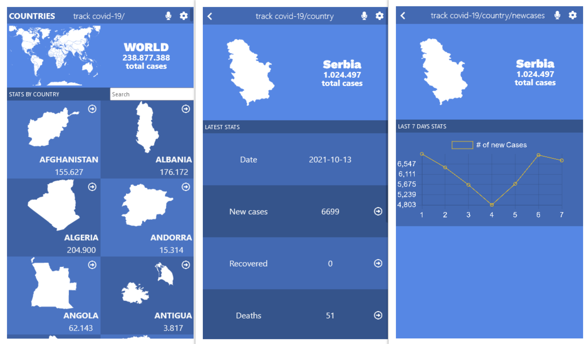

# Covid-19 Tracking Project

> "Covid-19 Tracking Project" is a mobile web application that displays Covid-19 tracking data from [Narrativa API](https://covid19tracking.narrativa.com/index_en.html).You can check detailed data for each country separately. It was built using React and Redux libraries.




## Built With

- React
- Redux

## Live demo link

[Demo link]()

## Getting Started

To get a local copy up and running follow these simple example steps.

### Prerequisites

- Node.js
- npm

### Setup

Clone the repository with:

```
git clone git@github.com:ShinobiWarior/Covid-19-Tracking-Project.git
```
or download [ZIP file](https://github.com/ShinobiWarior/Covid-19-Tracking-Project/archive/refs/heads/dev.zip)

### Install
To install all dependencies run:
```
npm install
```
### Usage
To run it on the browser you can run in the project directory:

 ```
 npm start
 ```

## Run tests 
To test the project please run in the project directory:

```
npm test
```

## Author

👤👤 **Aleksandar Ivezic**

- GitHub: [@Aleksandar Ivezic](https://github.com/ShinobiWarior)
- Twitter: [@AIvezic](https://twitter.com/AIvezic)
- LinkedIn: [Aleksandar Ivezic](https://www.linkedin.com/in/aleksandar-ivezic/)

## 🤝 Contributing

Contributions, issues, and feature requests are welcome!

Feel free to check the [issues page](https://github.com/ShinobiWarior/Covid-19-Tracking-Project/issues/).

## Show your support

Give a ⭐️ if you like this project!

## Acknowledgments

- This project was inspired by [Microverse](https://www.microverse.org/?grsf=w9rx3c)
- Big thanks to:
   - [Behance](https://www.behance.net/gallery/31579789/Ballhead-App-(Free-PSDs)) Design idea from [Nelson Sakwa](https://www.behance.net/sakwadesignstudio).
   - and [Regis Freid](https://github.com/djaiss) and his [Svg maps](https://github.com/djaiss/mapsicon)

## 📝 License

This project is [MIT](https://github.com/ShinobiWarior/Covid-19-Tracking-Project/blob/dev/LICENSE) licensed.
